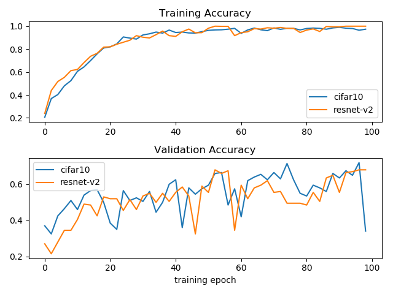

# java-audio-embedding

Audio embedding in Java

The current project attempts to develop a pure Java audio encoder that can be used in pure Java or Android program. 
Such an audio encoder can be used for music genres classification or music search, or music recommend-er.

The current project contains currently two deep learning networks adopted from:

* resnet
* cifar

The training and validation of these two models are showned below:



# Usage

### Train audio classifier in Keras

The machine learning package in Java is tensorflow, it loads a pre-trained audio classifier model (.pb format).
The audio classifier model was originally implemented and trained using Keras in Python. This trained
classifier model (in .h5 format) was then converted to .pb model file which can be directly loaded by tensorflow in Java.

The keras training of audio classifier model can be found in [README_Training.md](README_Training.md)

### Run audio classifier in Java
 
The [sample codes](java_audio_classifier/src/main/java/com/github/chen0040/tensorflow/classifiers/demo/Cifar10AudioClassifierDemo.java) 
below shows how to use the audio classifier to predict the genres of music:

```java
import com.github.chen0040.tensorflow.classifiers.models.cifar10.Cifar10AudioClassifier;
import com.github.chen0040.tensorflow.classifiers.utils.ResourceUtils;
import org.slf4j.Logger;
import org.slf4j.LoggerFactory;

import java.io.File;
import java.io.IOException;
import java.io.InputStream;
import java.util.ArrayList;
import java.util.Collections;
import java.util.List;

InputStream inputStream = ResourceUtils.getInputStream("tf_models/cifar10.pb");
Cifar10AudioClassifier classifier = new Cifar10AudioClassifier();
classifier.load_model(inputStream);

List<String> paths = getAudioFiles();

Collections.shuffle(paths);

for (String path : paths) {
    System.out.println("Predicting " + path + " ...");
    File f = new File(path);
    String label = classifier.predict_audio(f);

    System.out.println("Predicted: " + label);
}
```  

 
The [sample codes](java_audio_classifier/src/main/java/com/github/chen0040/tensorflow/classifiers/demo/ResNetV2AudioClassifierDemo.java) 
below shows how to use the audio classifier to predict the genres of music:

```java
import com.github.chen0040.tensorflow.classifiers.resnet_v2.ResNetV2AudioClassifier;
import com.github.chen0040.tensorflow.classifiers.utils.ResourceUtils;
import org.slf4j.Logger;
import org.slf4j.LoggerFactory;

import java.io.File;
import java.io.IOException;
import java.io.InputStream;
import java.util.ArrayList;
import java.util.Collections;
import java.util.List;

InputStream inputStream = ResourceUtils.getInputStream("tf_models/resnet-v2.pb");
ResNetV2AudioClassifier classifier = new ResNetV2AudioClassifier();
classifier.load_model(inputStream);

List<String> paths = getAudioFiles();

Collections.shuffle(paths);

for (String path : paths) {
    System.out.println("Predicting " + path + " ...");
    File f = new File(path);
    String label = classifier.predict_audio(f);

    System.out.println("Predicted: " + label);
}
```  

### Extract features from audio in Java


