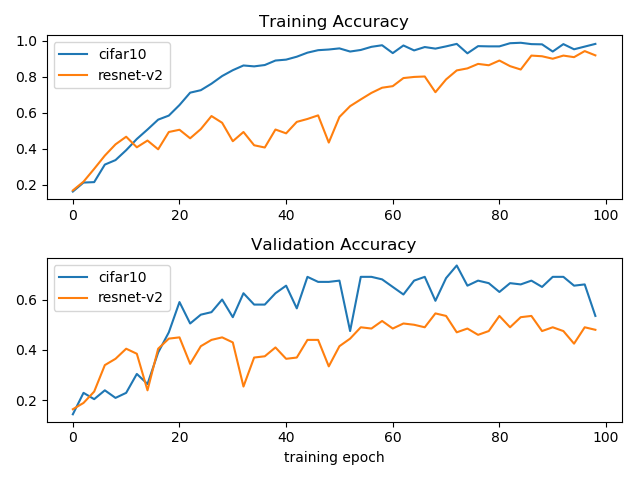

# java-audio-embedding

Audio embedding in Java

# Usage

### Generate training data in Java

The audio classification uses [Gtzan](http://opihi.cs.uvic.ca/sound/genres.tar.gz) data set to train the
music classifier to recognize the genre of songs. 

After the gtzan data is download into [gtzan](gtzan) folder, unzip the files in that folder so that you have a
folder structure like "gtzan/genres/(folder_with_class_label_as_name)"

The Java class that can converts audio file (.au) in gtzan data set to image file (.png) is
 [MelSpectrogram.java](src/main/java/com/github/chen0040/tensorflow/audio/MelSpectrogram.java)
 
[MelSpectrogram.java](src/main/java/com/github/chen0040/tensorflow/audio/MelSpectrogram.java) uses TarsosDSP to
convert an audio file to a mel-spectrogram image.
  
The following Java sample codes convert the audio file audio.au into a mel-spectrogram image:

```java
import com.github.chen0040.tensorflow.audio.MelSpectrogram;
import javax.imageio.ImageIO;
import java.awt.image.BufferedImage;
import java.io.File;

MelSpectrogram melGram = new MelSpectrogram();
BufferedImage image = melGram.convertAudio(new File("samples/audio.au"));
File outputFile = new File("outputs/saved.png");
ImageIO.write(image, "png", outputFile);
```

To batch converts all audio files in the gtzan/genres to images, right click [MelSpectrogram.java](src/main/java/com/github/chen0040/tensorflow/audio/MelSpectrogram.java)
and select "Run main() ..." in IntelliJ (or other IDE such as Eclipse), this will convert every .au file in 
the gtzan/genres folder to the corresponding .png files in the same folders.

### Train a audio classifier using Keras in Python

The classification works by converting audio or song file into a mel-spectrogram which can be thought of
a 3-dimension matrix in a similar manner to an image 

To train on the Gtzan data set, run the following command:

```bash
cd demo
python cifar10_train.py
```

The [sample codes](demo/cifar10_train.py) below show how to train Cifar10AudioClassifier to classify songs
based on its genre labels:

```python
from keras_audio.library.cifar10 import Cifar10AudioClassifier


def load_audio_path_label_pairs(max_allowed_pairs=None):
    
    audio_paths = []
    with open('./data/lists/test_songs_gtzan_list.txt', 'rt') as file:
        for line in file:
            audio_path = '../' + line.strip()
            audio_paths.append(audio_path)
    pairs = []
    with open('./data/lists/test_gt_gtzan_list.txt', 'rt') as file:
        for line in file:
            label = int(line)
            if max_allowed_pairs is None or len(pairs) < max_allowed_pairs:
                pairs.append((audio_paths[len(pairs)], label))
            else:
                break
    return pairs


def main():
    audio_path_label_pairs = load_audio_path_label_pairs()
    print('loaded: ', len(audio_path_label_pairs))

    classifier = Cifar10AudioClassifier()
    batch_size = 8
    epochs = 100
    history = classifier.fit(audio_path_label_pairs, model_dir_path='./models', batch_size=batch_size, epochs=epochs)


if __name__ == '__main__':
    main()

```

After training, the trained models are saved to [demo/models](demo/models). 

* The training accuracy reached over 80% after 29 epochs.
* The training accuracy reached over 90% after 38 epochs.
* The training accuracy after 100 epochs is 98.13%, with validation accuracy of 71%. 

Below compares training quality of 
[ResNetV2AudioClassifier](keras_audio/library/resnet_v2.py) and [Cifar10AudioClassifier](keras_audio/library/cifar10.py):



To test the trained Cifar10AudioClassifier model, run the following command:

```bash
cd demo
python cifar10_predict.py
```

The [sample codes](demo/cifar10_predict.py) shows how to test the trained Cifar10AudioClassifier model:

```python
from random import shuffle

from keras_audio.library.cifar10 import Cifar10AudioClassifier
from demo.gtzan_utils import gtzan_labels


def load_audio_path_label_pairs(max_allowed_pairs=None):
    
    audio_paths = []
    with open('./data/lists/test_songs_gtzan_list.txt', 'rt') as file:
        for line in file:
            audio_path = '../' + line.strip()
            audio_paths.append(audio_path)
    pairs = []
    with open('./data/lists/test_gt_gtzan_list.txt', 'rt') as file:
        for line in file:
            label = int(line)
            if max_allowed_pairs is None or len(pairs) < max_allowed_pairs:
                pairs.append((audio_paths[len(pairs)], label))
            else:
                break
    return pairs


def main():
    audio_path_label_pairs = load_audio_path_label_pairs()
    shuffle(audio_path_label_pairs)
    print('loaded: ', len(audio_path_label_pairs))

    classifier = Cifar10AudioClassifier()
    classifier.load_model(model_dir_path='./models')

    for i in range(0, 20):
        audio_path, actual_label_id = audio_path_label_pairs[i]
        predicted_label_id = classifier.predict_class(audio_path)
        print(audio_path)
        predicted_label = gtzan_labels[predicted_label_id]
        actual_label = gtzan_labels[actual_label_id]
        
        print('predicted: ', predicted_label, 'actual: ', actual_label)


if __name__ == '__main__':
    main()

```

The next step is to convert the trained keras model as tensorflow graph model file, run the following command:

```bash
cd demo
python cifar10_tensorflow_export_model.py
```

The script [demo/cifar10_tensorflow_export_model.py](demo/cifar10_tensorflow_export_model.py) export the trained model
as [demo/mdoels/tensorflow_models/cifar10/cifar10.pb](demo/models/tensorflow_models/cifar10/cifar10.pb) 

To test the exported tensorflow graph model file, run the following command:

```bash
cd demo
python cifar10_tensorflow_classifier.py
```

The script [demo/cifar10_tensorflow_classifier.py](demo/cifar10_tensorflow_classifier.py) uses pure tensorflow code
to load the [cifar10.pb](demo/models/tensorflow_models/cifar10/cifar10.pb) and uses it to predict genres of the 
songs

### Music genres prediction using Tensorflow in Java

We finally obtain a tensorflow pb file after the training, this can be loaded into tensorflow in a Java program and
be used for music genres prediction.  


# Note 

# Configure Keras to run on GPU on Windows

* Step 1: Change tensorflow to tensorflow-gpu in requirements.txt and install tensorflow-gpu
* Step 2: Download and install the [CUDA® Toolkit 9.0](https://developer.nvidia.com/cuda-90-download-archive) (Please note that
currently CUDA® Toolkit 9.1 is not yet supported by tensorflow, therefore you should download CUDA® Toolkit 9.0)
* Step 3: Download and unzip the [cuDNN 7.4 for CUDA@ Toolkit 9.0](https://developer.nvidia.com/cudnn) and add the
bin folder of the unzipped directory to the $PATH of your Windows environment 


